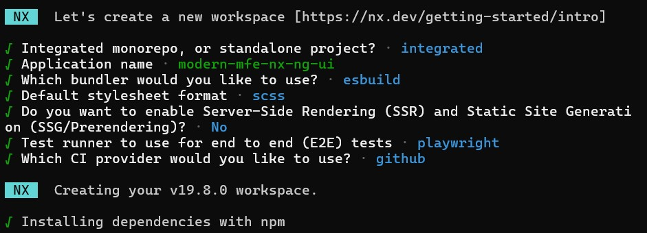

# Micro Frontend with Nx and Angular in ASP.NET Framework

## Overview

This project demonstrates how to create a micro frontend architecture using Nx and Angular, and embed it into an ASP.NET Framework application. Micro frontends allow for the development of independent frontend applications that can be integrated into a single user interface.

## Prerequisites

Before you begin, ensure you have the following installed:

- Node.js (v12 or later)
- Angular CLI
- Nx CLI
- .NET Framework (version 4.7 or later)
- Visual Studio (for ASP.NET development)

## Project Structure

- **/modern-mfe-nx-ng-ui**: Contains the Nx workspace and Angular applications.
- **/legacy-dotnet-app**: The ASP.NET Framework application that serves as the host for the micro frontends.

## Getting Started

### Step 1: Set Up Nx and Angular

1. **Create an Nx workspace (i.e. modern-mfe-nx-ng-ui)**:

   ```bash
   npx create-nx-workspace@latest modern-mfe-nx-ng-ui --preset=angular

   

2. **To add another micro-frontend (i.e. admin-dashboard & apps/user-dashboard) application inside an existing NX workspace**:

   ```bash
   npx nx generate @nrwl/angular:application apps/admin-dashboard

   ```bash
   npx nx generate @nrwl/angular:application apps/user-dashboard

3. **To add module inside a micro-frontend (i.e. admin-dashboard & apps/user-dashboard) application**:

 ```bash
   npx nx generate @nrwl/angular:module dashboard --project=admin-dashboard --routing 

 ```bash
   npx nx generate @nrwl/angular:module dashboard --project=user-dashboard --routing 

 ```bash
   npx nx generate @nrwl/angular:module dashboard --project=modern-mfe-nx-ng-ui --routing 

4. **To add component inside a module in a micro-frontend (i.e. admin-dashboard & apps/user-dashboard) application**:

 ```bash
   npx nx generate @nrwl/angular:component dashboard --project=admin-dashboard --module=apps/admin-dashboard/src/app/dashboard/dashboard.module.ts

 ```bash
   npx nx generate @nrwl/angular:component dashboard --project=user-dashboard --module=apps/user-dashboard/src/app/dashboard/dashboard.module.ts

 ```bash
   npx nx generate @nrwl/angular:component dashboard --project=modern-mfe-nx-ng-ui --module=apps/modern-mfe-nx-ng-ui/src/app/dashboard/dashboard.module.ts

### Step 2: Run your Micro Front App (i.e. admin-dashboard & user-dashboard) & Shell App (i.e. modern-mfe-nx-ng-ui)

1. **To run micro frontend and shell applications individually**:

```bash
   npx nx serve admin-dashboard --port=4201
   npx nx serve user-dashboard --port=4202
   npx nx serve modern-mfe-nx-ng-ui --port=4200

2. **To run micro frontend and shell applications in a single command**:

```bash
   npx nx serve admin-dashboard & npx nx serve user-dashboard & npx nx serve modern-mfe-nx-ng-ui 

```bash
   npm run serve

### Step 3: Build your Micro Front App (i.e. admin-dashboard & user-dashboard) & Shell App (i.e. modern-mfe-nx-ng-ui)

1. **To build micro frontend and shell applications individually**:

```bash
   npx nx build admin-dashboard --port=4201
   npx nx build user-dashboard --port=4202
   npx nx build modern-mfe-nx-ng-ui --port=4200

2. **To build micro frontend and shell applications in a single command**:

```bash
   npx nx build admin-dashboard & npx nx build user-dashboard & npx nx build modern-mfe-nx-ng-ui 

```bash
   npm run build